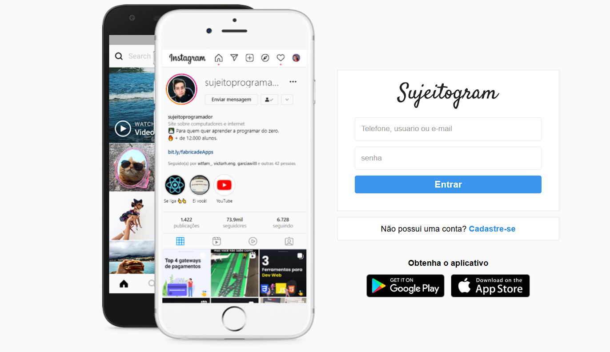

    

# Projeto SujeitoGram

Projeto página de login e de cadastro do instagram. 

## 🔥 Introdução

Criado com a finalidade de praticar e melhorar meus  conhecimentos em HTML/CSS.

## 📦 Tecnologias usadas:

* 
* 
 

## 👷 Autor

* **Rhuann Bittencourt** - *Frontend do projeto* - [Perfil Github](https://github.com/rhuanbittencourt)

* [Clique aqui para ver o projeto online](https://rhuanbittencourt.github.io/sujeitogram/)

